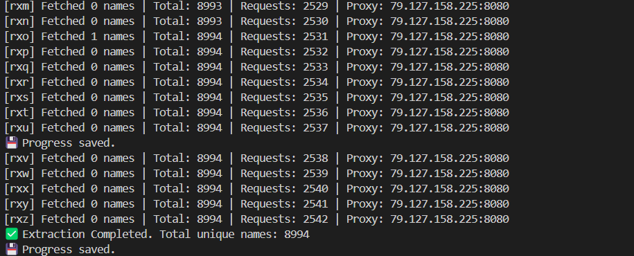
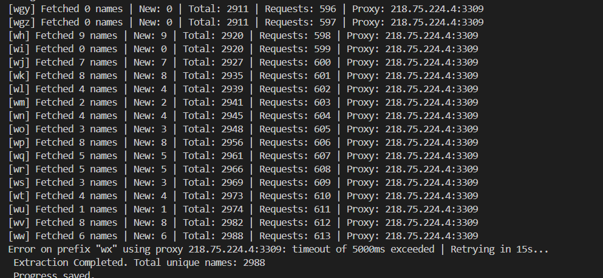

#  Fetching names with Rotating Proxies , Multiple APIs calls in Parallel & Continuous Progress Save

This project extracts unique names using an autocomplete API with rotating proxies. It ensures continuous execution, saves progress, and resumes even after a restart.

## Features
- **Rotating Proxies**: Uses multiple proxies to avoid rate limits.
- **Progress Saving**: Automatically saves progress and resumes if stopped.
- **Error Handling & Retrying**: Retries failed requests and switches proxies if needed.
- **Efficient Parallel Processing**: Uses multiple parallel requests for faster extraction.

---

## How to Start

Navigate to the API version folder:
```sh
cd v1
npm install
node workers.js
```

## Project Structure:
```sh
/v1 (same for v2 and v3)
│── workers.js          # Main script for fetching names
│── handleProxy.js      # Manages proxies
│── progress.json       # Auto-saved progress data
│── results.json        # Extracted names
│── package.json        # Dependencies
│── result.png          # Screenshot of termainl on final extraction.

/v2
│── ...

/v3
│── ...
```

## Results

### API Rate Limit = 100 requests per minute

### V1

- Total Names: `18632`
- Total Requests: ``

- 

### V2

- Total Names: `8994`
- Total Requests: `2542`

- 

### V3

- Total Names: `2988`
- Total Requests: `613`

- 

- Before implementing the solution, extensive inquiries were conducted to identify various endpoints and query structures that could be useful

- Several issues arose while implementing the solution, including:

• Handling rate limits and timeouts while making requests.

• Proxy failures leading to retries and increased delay.

• Managing progress tracking to ensure the script can resume from where it left off.

• Data inconsistencies that required error handling & retries

• Since free VMs did not work as expected, the next approach was using multiple proxies to handle requests efficiently.

• The main goal was not just fetching data but also optimizing the process to make it faster and scalable.

• For finding rate limit systematic approach was taken to know whether 

- To find the exact rate limits when they are not documented:

Start with a Controlled Request Rate
Begin with 1 request per second and gradually increase the rate.
and in this way we get the rate limit of the api and for the different versioning we get rate limit as:
v1: 100 requests per minute
v2: 50 requests per minute
v3: 30 requests per minute
these all rate limits are for one ip per minute basis
Heres the link for initial findings :https://drive.google.com/drive/folders/1FBrYa1tsXHgzaBfwWV1kqZFDn35I_v1q?usp=drive_link
these were done in python initially than switched to js